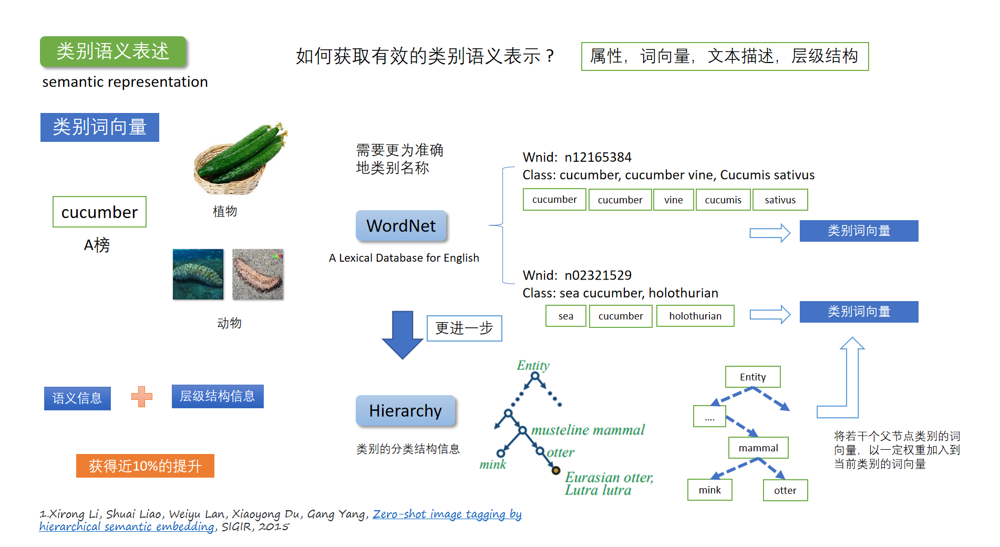

### 背景
监督学习面临的问题
- 面对数以千万级别的数据时，人工标注图像标签成本过高；
- 对于新兴出现的事物，或者稀有事物，收集标注数据很困难，比如安全领域，敏感人物、色情、药物等违规图像，本身数据量很少，突发性很强；

在只有少量标注数据，甚至没有标注数据的情况下，如何训练一个有效的模型。

为了绕过必须有大量标注数据的要求，零样本学习应用而生。传统的监督学习模型，如，各种CNN分类器，都是直接学习一个图像到标签的直接映射关系：给模型输入一张图像，直接输出对应的标签。  
零样本学习的做法是在图像和标签中间引入一个中间层，先将图像映射到中间层，然后再由中间层映射到标签。

### 1，如何获取有效的类别语义表示 ?

#### 从官方类别标签到WordNet类别标签
数据集中有一个类别打上了cucumber标签。从单词意思上看，这个类别应该是黄瓜。但是查看图片时发现，这个标签对应的图片都是海参的图片。海参英文名字叫 sea cucumber，这就不奇怪了。这种情况说明，我们需要更为准确的类别名称。

另外，数据集里面的类别和ImageNet中的类别几乎完全重合，而ImageNet又是根据WordNet构建的。所以我们就把训练集里面的类别在WordNet中对应类别的id找出来。这样我们就可以不根据官方给出的类别标签获取词嵌入，而是根据WordNet中的类别名称获取词嵌入。

#### 从单个词嵌入到融合多个词嵌入
WordNet中每个节点对应一个物体类别，这个物体类别名称一般是多个单词组成。 比如，海参在WordNet中的名称为`sea cucumber, holothurian`
在获取当前类别的语义向量时，根据WordNet中类别名称，分别获取类别名称中出现的单词的词向量，然后将所有词向量取平均。

#### 加入类别层级结构信息

更近一步
WordNet是一种树形的词典。可以根据当前类别节点的ID找到其父节点，比如，sea cucumber的父节点可能是海生动物、动物等等。将父节点的类别语义嵌入以一定权重加入，math.exp(-layer)。

### 2，如何训练CNN模型，获取具有辨别力的图片特征 ?

### 3，如何做视觉空间与语义空间的映射关系 ?

### 4，如何做最终的类别预测模型？
